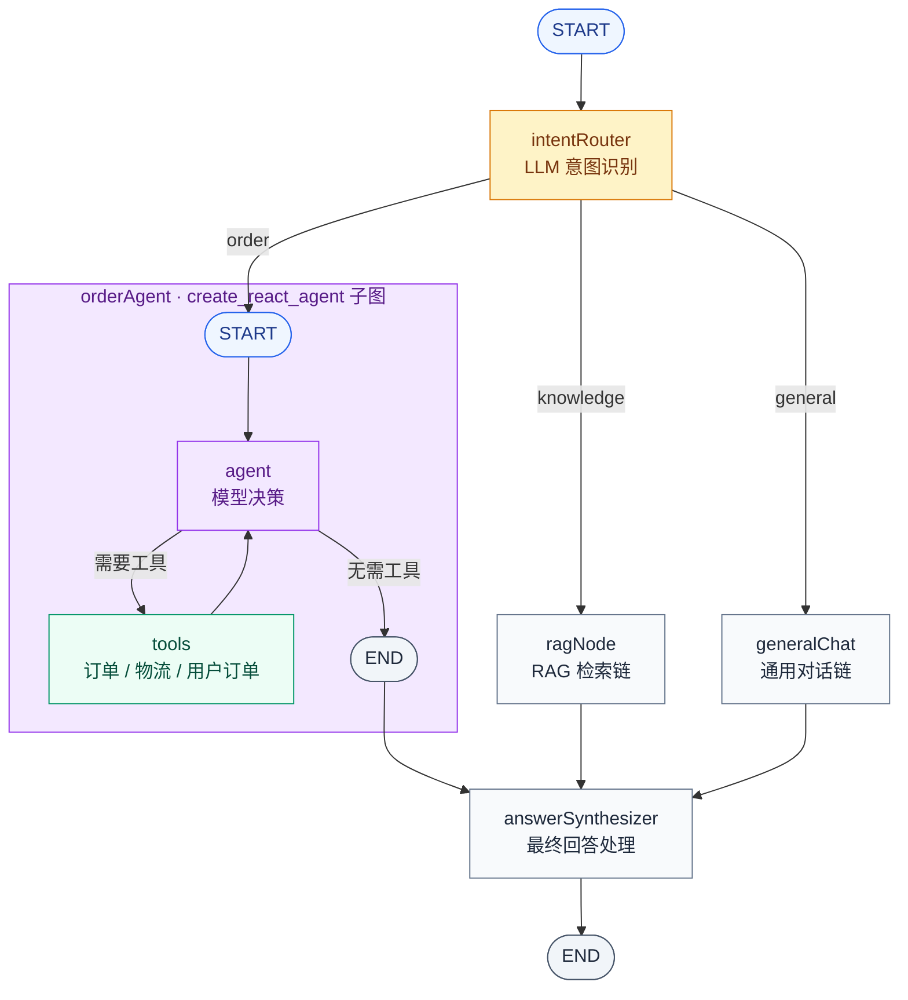

# 极速购 AI 客服系统

一个围绕虚构电商平台“极速购”的 AI 客服学习项目。项目用同一套客服场景，串起四种常见的 AI 应用实现方式：基础对话 Chain、可调用工具的 ReAct Agent、RAG 知识库问答，以及负责意图路由和最终回答处理的 LangGraph 工作流。

> 项目中的订单、物流、用户和商品知识库均为模拟数据，主要用于学习、演示和面试讲解，不连接真实业务系统，也不能直接作为生产客服使用。

## 项目定位

这个项目不是把所有逻辑都写成 Agent，而是刻意展示不同抽象层的适用场景：

| 能力 | 实现方式 | 适合解决的问题 |
| --- | --- | --- |
| 基础客服对话 | LangChain LCEL Chain | 固定的 Prompt → 模型 → 输出解析流程 |
| 订单查询 | LangGraph 预构建 ReAct Agent | 需要根据问题自主选择订单、物流或用户订单工具 |
| 商品与售后问答 | RAG Chain | 必须依据本地商品手册和售后政策回答的问题 |
| 智能中枢 | LangGraph `StateGraph` | 先识别意图，再把请求路由到合适的能力节点 |

这种组合体现了一个实际的设计原则：简单流程使用 Chain，需要自主调用工具时使用 Agent，需要跨能力编排时使用 Workflow。

## 功能一览

| 模块 | 页面 | 接口 | 说明 |
| --- | --- | --- | --- |
| 基础对话 | `/` | `POST /api/chat`、`POST /api/chat/stream` | 基于 DeepSeek 的普通与流式客服对话，支持历史消息。 |
| 订单 Agent | `/agent` | `POST /api/agent/stream` | 使用 `create_react_agent`，根据问题调用订单、物流和用户订单工具。 |
| 知识库问答 | `/rag` | `POST /api/rag/query` | 检索商品与售后 Markdown 文档，并返回回答和来源片段。 |
| 智能中枢 | `/graph` | `POST /api/graph/stream` | 识别 `order`、`knowledge`、`general` 意图，路由到对应节点并完成最终回答处理。 |

## 核心工作流与 Agent 子图

下面的图只展示核心工作流，不展开前后端和部署细节。一次请求只会根据意图选择 `orderAgent`、`ragNode`、`generalChat` 三个分支中的一个；图中的三条连线表示条件路由，不表示三个分支并行执行。被选中的分支完成后，才会进入代码中的 `answerSynthesizer` 节点（图中标注为“最终回答处理”）。`orderAgent` 在主流程中是一个 Agent 子图；它内部采用 LangGraph 预构建的 ReAct 循环。



### 如何理解这张图

1. `intentRouter` 使用低温度模型把用户请求分类为 `order`、`knowledge` 或 `general`。
2. LangGraph 根据分类结果只执行一条分支：订单问题进入 `orderAgent`，知识库问题进入 `ragNode`，其他问题进入 `generalChat`。
3. `orderAgent` 通过 ReAct 循环查询订单工具；`ragNode` 执行“检索文档 → 组装 Prompt → DeepSeek 生成回答”；`generalChat` 直接生成普通对话回答。
4. 被选中的分支完成后进入 `answerSynthesizer`。`general` 意图如果已经由 `generalChat` 生成 `final_answer`，该节点直接透传；`order` 意图把 Agent 查询结果交给模型生成最终客服话术；`knowledge` 意图则对 RAG 已生成的回答做一次统一改写。

## Agent 设计

### ReAct 执行循环

订单 Agent 使用 LangGraph 的 `create_react_agent`，不是手写 ReAct 状态图。它的核心循环可以概括为：

```text
START → agent（模型决策）
          ├── 不需要工具 → END
          └── 需要工具 → tools → agent（继续判断）
```

实际注册的工具位于 `server-py/app/tools/order_tools.py`：

- `getOrderInfo`：根据订单号查询订单详情
- `getLogisticsInfo`：根据快递单号查询物流轨迹
- `getUserOrders`：根据用户 ID 查询订单列表摘要

工具读取的是 `server-py/app/data/mock.py` 中的内存数据。工具返回 JSON 结果，Agent 读取结果后再组织自然语言回答，不直接把 JSON 展示给用户。

项目中有两条 Agent 使用路径：

- `/api/agent/stream`：独立运行客服 Agent，适合直接体验工具调用过程。
- `customer_graph.py` 中的 `orderAgent`：作为智能中枢的一个工作流节点，执行完成后把订单结果交给 `answerSynthesizer` 做最终回答处理。

两条路径都使用 ReAct Agent 和同一组订单工具，区别在于调用位置不同：前者是独立入口，后者嵌在更大的 StateGraph 中。

## RAG 设计

RAG 使用的是基础 Chain，不再额外构造 Agent。它分为离线入库和在线查询两个阶段。

### 离线入库

1. 读取 `server-py/app/data/knowledge/products.md` 和 `policies.md`。
2. 使用 `RecursiveCharacterTextSplitter` 切分文档，默认 `chunk_size=500`、`chunk_overlap=50`。
3. 调用智谱 `embedding-3` 生成向量。
4. 将向量和原文写入 PostgreSQL 的 pgvector 集合 `knowledge_embeddings`。

执行入口：

```bash
python -m app.scripts.ingest
```

### 在线查询

```text
用户问题
   ↓
向量检索 Top-4 文档片段
   ↓
拼接知识库上下文
   ↓
Prompt + DeepSeek
   ↓
回答与来源片段
```

如果知识库没有相关内容，Prompt 要求模型如实说明，不根据常识编造商品或售后政策。

## 技术栈

- 前端：Vue 3、Vue Router、Vite
- 后端：Python、FastAPI、Uvicorn、Pydantic
- Agent 与工作流：LangChain、LangGraph、`create_react_agent`
- 对话模型：DeepSeek OpenAI 兼容接口
- 向量模型：智谱 AI `embedding-3`（默认），保留阿里云百炼切换示例
- 向量数据库：PostgreSQL、pgvector、`langchain-postgres`
- 流式传输：Server-Sent Events（SSE）

## 项目结构

```text
jishugou/
├── client/                         # Vue 前端页面
│   ├── src/views/                  # 基础对话、Agent、RAG、Graph 页面
│   ├── src/composables/            # SSE 请求、消息和页面状态
│   └── src/router/                 # 前端路由
├── server-py/                      # FastAPI 后端
│   ├── app/
│   │   ├── agents/                 # 独立 ReAct Agent
│   │   ├── chains/                 # 基础对话 Chain 与 RAG Chain
│   │   ├── data/                   # 模拟订单、物流和知识库文档
│   │   ├── db/                     # PostgreSQL 连接配置
│   │   ├── graphs/                 # LangGraph 工作流、状态和节点
│   │   ├── models/                 # DeepSeek 与 Embedding 封装
│   │   ├── prompts/                # 客服与路由 Prompt
│   │   ├── routers/                # FastAPI 接口
│   │   ├── scripts/ingest.py       # RAG 知识库入库
│   │   └── tools/                  # Agent 工具定义
│   ├── .env.example
│   └── requirements.txt
└── README.md
```

## 环境要求

- Python 3.10+
- Node.js 18+
- pnpm（项目已提交 `pnpm-lock.yaml`）
- PostgreSQL，并启用 `pgvector` 扩展（RAG 功能需要）
- DeepSeek API Key（对话、Agent 和工作流需要）
- 智谱 AI API Key（默认 RAG Embedding 需要）

## 快速开始

### 1. 创建 PostgreSQL 数据库

以下以 `jisu_ai` 数据库为例：

```sql
CREATE DATABASE jisu_ai;
\c jisu_ai
CREATE EXTENSION IF NOT EXISTS vector;
```

`langchain_postgres.PGVector` 会在首次使用时创建所需的集合和表，不需要手动设计向量表结构。

### 2. 安装后端依赖并配置环境变量

```powershell
cd server-py
python -m venv .venv
.\.venv\Scripts\Activate.ps1
pip install -r requirements.txt
Copy-Item .env.example .env
```

macOS/Linux：

```bash
cd server-py
python3 -m venv .venv
source .venv/bin/activate
pip install -r requirements.txt
cp .env.example .env
```

编辑 `server-py/.env`：

| 变量 | 必填场景 | 说明 |
| --- | --- | --- |
| `DEEPSEEK_API_KEY` | 所有模型能力 | DeepSeek API Key。 |
| `DEEPSEEK_BASE_URL` | 可选 | 默认 `https://api.deepseek.com/v1`。 |
| `MODEL_NAME` | 可选 | 默认 `deepseek-chat`。 |
| `ZHIPU_API_KEY` | RAG | 默认的智谱 Embedding API Key。 |
| `DASHSCOPE_API_KEY` | 可选 | 使用阿里云 Embedding 时配置，并同步切换 `app/models/embedding.py`。 |
| `PG_HOST`、`PG_PORT` | RAG | PostgreSQL 主机和端口。 |
| `PG_USER`、`PG_PASSWORD` | RAG | PostgreSQL 登录凭据。 |
| `PG_DATABASE` | RAG | 数据库名，默认 `jisu_ai`。 |

`.env` 只保留在本地，不能提交真实 API Key、数据库密码或其他凭据。

### 3. 导入知识库

首次使用 RAG、修改知识库 Markdown，或需要重建向量数据时执行：

```powershell
python -m app.scripts.ingest
```

该脚本会清空并重建 `knowledge_embeddings` 集合。后端启动前建议先完成一次入库。

### 4. 启动后端

在 `server-py` 目录、虚拟环境已激活的终端中运行：

```powershell
uvicorn app.main:app --reload --port 3000
```

服务地址：`http://localhost:3000/`

健康检查：`http://localhost:3000/api/chat/health`

### 5. 启动前端

另开终端：

```powershell
cd client
pnpm install
pnpm dev
```

当前前端请求地址固定为 `http://localhost:3000/api`，本地开发时后端请使用 3000 端口。

## API 接口

除健康检查外，接口都接收 JSON 请求体；带 `/stream` 的接口使用 SSE。

| 方法 | 路径 | 请求字段 | 事件或返回 |
| --- | --- | --- | --- |
| `GET` | `/api/chat/health` | 无 | JSON 健康状态。 |
| `POST` | `/api/chat` | `message`、可选 `history` | 一次性 JSON 回答。 |
| `POST` | `/api/chat/stream` | `message`、可选 `history` | `content`、`done`、`error`。 |
| `POST` | `/api/agent/stream` | `message`、可选 `history` | `step`、`answer`、`done`、`error`。 |
| `POST` | `/api/rag/query` | `question` | `sources`、`answer`、`done`、`error`。 |
| `POST` | `/api/graph/stream` | `message`、可选 `history` | `node`、`steps`、`answer`、`done`、`error`。 |

`history` 中每项格式如下：

```json
{
  "role": "user",
  "content": "你好"
}
```

### 调用示例

```bash
# 基础对话
curl -X POST http://localhost:3000/api/chat \
  -H "Content-Type: application/json" \
  -d '{"message":"你好"}'

# 订单 Agent：模拟订单 ORD-001
curl -N -X POST http://localhost:3000/api/agent/stream \
  -H "Content-Type: application/json" \
  -d '{"message":"帮我查一下订单 ORD-001 的状态"}'

# RAG：查询售后知识库
curl -N -X POST http://localhost:3000/api/rag/query \
  -H "Content-Type: application/json" \
  -d '{"question":"退换货政策是什么？"}'

# LangGraph 工作流：自动识别订单、知识库或闲聊意图
curl -N -X POST http://localhost:3000/api/graph/stream \
  -H "Content-Type: application/json" \
  -d '{"message":"我的快递到哪了，单号 SF1234567890"}'
```

使用 `curl` 查看 SSE 时保留 `-N`，避免输出缓冲。基础对话接口会流式发送文本片段；Agent、RAG 和 Graph 主要发送工具、来源、节点和最终答案等过程事件。

## 常见问题

### 后端启动或 RAG 查询时报 PostgreSQL 错误

确认 PostgreSQL 已启动、数据库存在、`vector` 扩展已启用，并检查 `.env` 中的 `PG_*` 配置。RAG 链在后端导入时会构造 `PGVector`，因此建议在启动服务前完成数据库配置。

### RAG 没有检索结果或内容过期

重新执行：

```bash
python -m app.scripts.ingest
```

每次修改 `server-py/app/data/knowledge/` 下的文档后都需要重新入库。

### 模型返回 401 或 403

检查 `DEEPSEEK_API_KEY`、`ZHIPU_API_KEY` 或 `DASHSCOPE_API_KEY` 是否有效，并确认账户额度和模型权限。

### 前端无法请求后端

确认后端运行在 `http://localhost:3000`。前端 API 地址目前写在 `client/src/composables/` 中，部署到其他环境前需要改成可配置地址。

## GitHub 发布清单

可以提交：

- `client/src/`、`client/package.json`、`client/pnpm-lock.yaml`
- `server-py/app/`、`server-py/requirements.txt`
- `server-py/.env.example`、README 和其他说明文档
- 模拟订单、物流数据和知识库 Markdown 文档

不要提交：

- `.env`、真实 API Key、数据库密码和其他凭据
- `.venv/`、`node_modules/`、`dist/`、`__pycache__/`、`*.pyc`
- 本地数据库导出、日志、证书、私钥和临时文件

根目录 `.gitignore` 已覆盖常见环境文件、依赖目录、构建产物和密钥文件。提交前仍应检查：

```powershell
git status
git diff --cached
```

## 当前边界与生产化方向

- 订单、用户和物流数据来自内存模拟数据，不连接真实 ERP、订单或物流系统。
- Agent、RAG 和 Graph 接口使用 SSE 展示过程事件，但当前内部调用主要是同步 `invoke`，并非所有接口都提供 Token 级流式输出。
- 前端 API 地址固定为 `localhost:3000`，尚未做环境变量配置。
- 后端 CORS 当前允许任意来源，仅适用于本地演示；上线前应限制可信域名。
- 当前没有用户认证、权限控制、真实业务数据脱敏、持久化会话和生产级监控。
- RAG 入库脚本采用全量重建方式，知识库规模扩大后应改为增量更新和版本管理。
- 项目未附带许可证，公开发布前请根据开源意图补充合适的 `LICENSE`。

如果要继续工程化，可以优先补充真实业务 API 适配层、异步模型调用、统一错误码、可配置前端地址、鉴权、观测指标和自动化测试。
